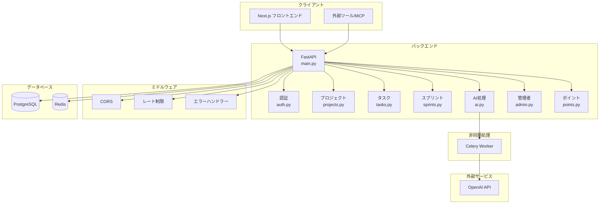

# AI搭載プロジェクト管理アプリ TaskForge 詳細設計書

## 1. 目的
本ドキュメントは、基本設計に基づき、フロントエンド、バックエンド、データベース、およびAIモジュールの具体的な実装方針やクラス・ファイル構成、スキーマ定義などの詳細を定義する。

---

## 2. フロントエンド詳細設計（Next.js App Router）

### 2.1 ディレクトリ構成
機能ごとに凝集度を高め、`src/` 配下に以下のように配置する。

```text
src/
 ├─ app/                  # ルーティング（App Router）
 │   ├─ (auth)/           # 認証関連（/login, /register）
 │   ├─ dashboard/        # プロジェクト一覧（/dashboard）
 │   ├─ projects/
 │   │   └─ [id]/         # プロジェクト詳細・タスク管理（/projects/:id）
 │   └─ admin/            # 管理者画面（refine 統合領域）
 ├─ components/
 │   ├─ ui/               # 汎用UI（shadcn/uiコンポーネント群、lucide-reactアイコン）
 │   ├─ views/            # ビュー切替コンポーネント（Kanban, Scrum, Gantt）
 │   └─ features/         # ドメイン固有（AITaskModal など）
 ├─ lib/                  # ユーティリティ、設定
 │   ├─ api/              # APIクライアント（fetchラッパーやaxios設定）
 │   └─ validations/      # バリデーションスキーマ（zod）
 ├─ hooks/                # カスタムフック（データフェッチ/React Query等）
 └─ types/                # 共通のTypeScript型定義
```

### 2.2 OpenAPI型自動生成

バックエンドのPydanticスキーマからOpenAPI仕様書経由でTypeScript型を自動生成します。

#### ワークフロー

```
Backend (Pydantic) → OpenAPI (/openapi.json) → openapi-typescript → frontend/src/types/generated.ts
```

#### 型生成コマンド

```bash
# バックエンドが起動している状態で実行
just generate-types
# または
cd frontend && bun run generate:types
```

#### 生成ファイル

- **`frontend/src/types/generated.ts`**: OpenAPIから自動生成（1756行）
  - `paths`, `components`, `operations` などの型が含まれる
  - **手動編集禁止**
- **`frontend/src/types/index.ts`**: 便利な名前での再エクスポート
  - `Task`, `Project`, `TaskCreate` など

#### 使用方法

```typescript
// 自動生成された型をインポート
import type { Task, Project, TaskCreate } from "@/types";

// APIレスポンス型として使用
const { data }: { data: Task } = await api.get(`/api/tasks/${taskId}`);

// リクエストボディ型として使用
const newTask: TaskCreate = {
  title: "New Task",
  description: "Task description",
  // status, priorityはデフォルト値が設定される
};
```

#### 重要なルール

1. **`generated.ts`は手動で編集しない**
   - バックエンドのPydanticスキーマを変更したら、必ず`just generate-types`を実行
2. **フロントエンド固有の型のみ手動定義**
   - UI状態（`TaskStatus = 'todo' | 'doing' | 'done'`など）は`types/index.ts`に手動定義
3. **型キャストが必要な場合**
   - バックエンドから返るstring/numberをリテラル型に変換する際は`as TaskStatus`などを使用
4. **CI/CD統合**
   - GitHub Actionsで型生成ステップを追加し、型チェックを自動化

#### スキーマ変更時の手順

1. バックエンドの`backend/app/api/schemas.py`を修正
2. バックエンドを再起動（OpenAPI仕様書が自動更新）
3. `just generate-types`を実行
4. フロントエンドの型チェックを実行（`bunx tsc --noEmit`）
5. 必要に応じてフロントエンドの型キャストを更新

### 2.3 状態管理・スタイリング要件（確定）
- **UI・スタイリング**: `Tailwind CSS` のユーティリティクラスを活用し、コンポーネントライブラリとして `shadcn/ui` を全面採用する。アイコンシステムは `lucide-react` を利用する。
- **管理者画面**: バックオフィス等の管理要件は `refine` フレームワークを用いて組み込み、開発コストを圧縮する。
- **フェッチ＆キャッシュ**: `TanStack Query` (React Query) を採用し、サーバー状態とポーリング等のキャッシュを管理。
- **グローバル状態**: UIの表示状態（現在選択中のビューなど）は `Zustand` を使用。
- **フォーム・バリデーション**: `React Hook Form` と `Zod` を組み合わせて堅牢なバリデーションと型安全を確保。
- **型安全**: OpenAPI自動生成型により、バックエンドスキーマとフロントエンド型の同期を自動化。

### 2.4 主要コンポーネント仕様
1. **ViewSwitcher**:
   - `activeView` (kanban | scrum | gantt) を状態として持ち、表示する `<KanbanView />`, `<ScrumView />`, `<GanttView />` を切り替える。
2. **KanbanView**:
   - `dnd-kit` を用いて実装（`react-beautiful-dnd` は非推奨のため不使用）。
   - OnDragEnd イベントにて、タスクのステータス変更API (`PUT /api/tasks/{id}`) を非同期で叩く。
3. **AITaskModal**:
   - ユーザー入力フォームと、結果表示領域を持つ。
   - 解析中（APIコール中）はロードスピナーを表示。レスポンスのJSONをリストやツリー表示でプレビュー。
   - 「反映」ボタンで各種作成APIを連続実行、または一括登録APIをコールする。

---

## 3. バックエンド詳細設計（FastAPI）

### 3.1 ディレクトリ構成
保守性とスケーラビリティを考慮し、以下のように階層化する。

```text
backend/
 ├─ app/
 │   ├─ main.py            # アプリケーションエントリポイント
 │   ├─ core/              # ヘルパー、セキュリティ、設定（JWT, 環境変数）
 │   ├─ api/
 │   │   ├─ dependencies.py # API共通依存（DBセッション、認証ユーザー取得）
 │   │   └─ routers/        # 各エンドポイントのルーター（auth, projects, ...）
 │   ├─ models/            # SQLModel のデータ定義（DBモデル兼Pydanticスキーマ）
 │   ├─ services/          # ビジネスロジック、AI連携（LangGraph 処理など）
 │   └─ worker.py          # Celery ワーカーエントリポイントおよび非同期処理タスク定義
 └─ pyproject.toml         # パッケージ・依存関係管理（uvを使用）
```

### 3.2 認証・認可フロー (core/security.py, api/dependencies.py)
- パスワードハッシュ化: `passlib` (with `bcrypt`) を利用。
- JWT生成: `python-jose` を利用し、ペイロードに `sub` (user_id) と `exp` (有効期限) を含める。
- `get_current_user` 依存関数: 
  1. API呼び出し時の `Authorization: Bearer <token>` をパース。
  2. トークンをデコード。デコードできた時点でペイロードの `sub` (user_id) と `role` 情報を信用し、**原則として毎回DBへの問い合わせは行わない（完全ステートレス化）**。
  3. パスワード変更時などのトークン無効化要件が発生した場合は、Redis等でのブラックリスト方式拡張を検討する（Phase 4以降）。

### 3.3 リクエスト/レスポンススキーマ (SQLModel)
SQLModelを利用することで、DBモデルとPydanticスキーマの定義を統合する。

**重要**: バックエンドのPydanticスキーマは、OpenAPI仕様書を通じてフロントエンドのTypeScript型に自動変換される（詳細は2.2節参照）。

例としてTaskモデルの定義：
```python
class TaskBase(SQLModel):
    title: str
    description: Optional[str] = None
    status: str = Field(default="todo")
    priority: int = Field(default=2)
    start_date: Optional[date] = None
    end_date: Optional[date] = None
    estimate: Optional[float] = None

class Task(TaskBase, table=True):
    id: Optional[int] = Field(default=None, primary_key=True)
    project_id: int = Field(foreign_key="project.id")
    sprint_id: Optional[int] = Field(default=None, foreign_key="sprint.id")
    created_at: datetime = Field(default_factory=datetime.utcnow)
    updated_at: datetime = Field(default_factory=datetime.utcnow)

class TaskCreate(TaskBase):
    sprint_id: Optional[int] = None

class TaskResponse(TaskBase):
    id: int
    project_id: int
    created_at: datetime
    updated_at: datetime
```

---

## 4. データベース詳細設計 (PostgreSQL & SQLModel)

### 4.1 カラム型および制約
| テーブル | カラム名 | データ型 (ORM) | 制約など |
|---|---|---|---|
| users | id | Integer | PrimaryKey, Autoincrement |
| users | email | String(255) | Unique, Not Null, Index |
| users | password_hash | String(255) | Not Null |
| projects | id | Integer | PrimaryKey, Autoincrement |
| projects | name | String(100) | Not Null |
| projects | owner_id | Integer | ForeignKey("users.id", ondelete="CASCADE") |
| sprints | id | Integer | PrimaryKey, Autoincrement |
| sprints | name | String(100) | Not Null |
| tasks | id | Integer | PrimaryKey, Autoincrement |
| tasks | project_id | Integer | ForeignKey("projects.id", ondelete="CASCADE"), Index |
| tasks | sprint_id | Integer | ForeignKey("sprints.id", ondelete="SET NULL"), Nullable |
| tasks | status | Enum/String | 'todo', 'doing', 'done' (Default: 'todo') |
| tasks | priority | Integer | 1=Low, 2=Medium, 3=High (Default: 2) |
| tasks | estimate | Float | Nullable (時間・ポイント等の数値を想定) |

※全テーブルに対して `created_at` (DateTime, Default: now()) および `updated_at` (DateTime, Default: now(), OnUpdate: now()) を付与するベースモデル（Base）を適用すること。

### 4.2 KVSスキーマ (Redis)
- **非同期タスクステータス管理**: `celery-task-meta-{task_id}` （Celeryの標準バックエンドを使用）
- **Celeryメッセージブローカー**: `celery` リスト（ジョブキュー）
- **JWTブラックリスト（将来拡張）**: `jwt_bl:{token_jti}` などのキーでログアウト済みトークンを管理。

---

## 5. AIモジュール詳細設計（LangGraph 処理フロー）

`services/ai_service.py` 内に構築する。

### 5.1 Graph State 定義
```python
from typing import TypedDict, List
class WorkflowState(TypedDict):
    user_requirement: str
    epics: List[dict]
    tasks: List[dict]
    error: str
```

### 5.2 ノード詳細
1. **EpicExtractor Node**:
   - プロンプト: 「以下の要件から、開発に必要な大分類（エピック）を抽出してください。JSON形式で出力すること。」
   - OpenAI API の Structured Outputs (`response_format`指定等) を使用して、`[{ "name": "...", "description": "..." }]` の形を確定させる。
2. **TaskDecomposer Node**:
   - 前段のエピック一覧を受け取り、それぞれを詳細タスクに分解。
   - プロンプト: 「各エピックに対して具体的な実装タスクを挙げ、仮の工数（時間）を見積もってください。」
3. **SprintPlanner Node**:
   - 抽出されたタスクを依存関係や工数をもとに、スプリント（例：Sprint 1, Sprint 2）に割り振る。
   - 最終出力としての要件定義（JSON構造）を完成させる。

---

## 6. エラーハンドリング・例外処理方針
1. **フロントエンド**:
   - APIリクエスト失敗時：グローバルなAxios/Fetchインターセプターで `react-toastify` や `sonner` などのToast通知を表示。
   - バリデーションエラー：各フォームコンポーネント内（Zod連携）でフィールド下部に赤字でエラーメッセージ表示。
2. **バックエンド**:
   - FastAPIの `HTTPException` を適切にスロー（400: バリデーション、401: 認証、403: 認可、404: リソース不在）。
   - キャッチされない例外はグローバルなException Handlerで捕捉し、500 Internal Server Errorとしてフォーマットし、スタックトレースはログのみに出力（本番環境想定）。

---

## 7. アーキテクチャ詳細（更新）

### 7.1 システム依存関係図



### 7.2 ミドルウェア構成

| ミドルウェア | 目的 | 設定 |
|------------|------|------|
| CORS | クロスオリジン制御 | 許可オリジンのみ |
| Rate Limiting | DDoS/ブルートフォース対策 | SlowAPI (5-100回/分) |
| Error Handler | グローバルエラー処理 | カスタム例外ハンドラー |
| Trusted Host | ホストヘッダー検証 | 本番ドメインのみ |

### 7.3 Celery + Redis 非同期処理アーキテクチャ

**構成**:
```
FastAPI → Celery Broker (Redis) → Celery Worker → OpenAI API
                                      ↓
                              Celery Backend (Redis)
                                      ↓
                            クライアント (ポーリング)
```

**ユースケース**:
- AIタスク分解（10-30秒かかる処理）
- リポジトリ分析
- 大量データ処理

**実装例**:
```python
# tasks/ai_tasks.py
from celery import Celery
from app.services.ai_service import run_ai_decomposition

celery_app = Celery(
    "taskforge",
    broker=settings.REDIS_URL,
    backend=settings.REDIS_URL
)

@celery_app.task(bind=True)
def decompose_tasks_async(self, project_id: int, prompt: str):
    """AIタスク分解を非同期で実行"""
    self.update_state(state="PROGRESS", meta={"progress": 0})
    
    result = run_ai_decomposition(prompt)
    
    self.update_state(state="SUCCESS", meta={"progress": 100})
    return result
```

### 7.4 LangGraph ワークフロー詳細

**State定義**:
```python
class WorkflowState(TypedDict):
    user_requirement: str
    epics: List[dict]
    tasks: List[dict]
    sprints: List[dict]
    error: Optional[str]
```

**ノードフロー**:
1. **Parse Requirement**: ユーザー入力からエピック抽出
2. **Decompose Tasks**: 各エピックを詳細タスクに分解
3. **Plan Sprints**: タスクをスプリントに割り当て
4. **Validate**: 結果の検証と整形

### 7.5 追加機能

#### ポイントシステム（実装済み）
- ユーザーの活動に応じてポイント付与
- 実績（Achievement）の自動解除
- リーダーボード表示

#### リポジトリ分析（実装済み）
- GitHubリポジトリの登録
- Tree-sitterによるコード構造解析
- 依存関係分析
- タスクとコードの関連付け

#### MCPエンドポイント（実装済み）
- 外部ツールとの統合
- AIエージェントによるAPI操作

---

## 8. 関連ドキュメント

- [API仕様書](./APISpecification.md)
- [データベース設計書](./DatabaseDesign.md)
- [セキュリティ設計書](./SecurityDesign.md)
- [基本設計書](./BasicDesign.md)
- [repowiki プロジェクト概要](../.qoder/repowiki/ja/content/プロジェクト概要.md)
